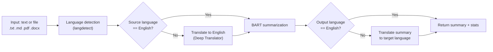
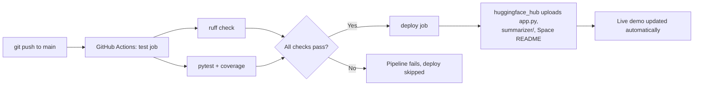

# Multilingual Text Summarizer

[](https://github.com/karim9191804/text-summarization-nlp/actions/workflows/ci-cd.yml)


[](https://huggingface.co/spaces/karimhoucem/text_summarization)

Abstractive text summarization for 100+ input languages, built on top of
BART and wrapped in a translate → summarize → translate-back pipeline.
Ships with a Gradio UI, an automated evaluation harness, and a CI/CD
pipeline that tests every change and redeploys the live demo automatically.

**Live demo:** https://huggingface.co/spaces/karimhoucem/text_summarization

## Why this project

Most summarization demos wrap a single English model and stop there. This
project treats the multilingual case as a first-class engineering problem:
automatic language detection, a translation bridge in both directions,
input validation, a reproducible evaluation harness (ROUGE + BERTScore),
and a deployment pipeline that keeps the public demo in sync with the
repository on every merge — the same shape as a small production NLP
service.

## Features

- **100+ input languages**, auto-detected with `langdetect`
- **5 output languages** (English, French, Spanish, German, Arabic)
- **File upload support**: `.txt`, `.md`, `.pdf`, `.docx`
- **3 length presets**: short (~80 words), medium (~150 words), long (~250 words)
- **Reproducible evaluation**: ROUGE-1/2/L and BERTScore on a multilingual sample set
- **CI/CD**: lint + unit tests on every push/PR, automatic deployment to Hugging Face Spaces on `main`
- **Dockerized** for local or self-hosted deployment

## How it works



The summarization core is a pretrained `facebook/bart-large-cnn` checkpoint
(hosted on the Hub as
[`karimhoucem/Multilingual_Text_Summarization_System-BART_v1.0.9`](https://huggingface.co/karimhoucem/Multilingual_Text_Summarization_System-BART_v1.0.9)),
used as-is — **no fine-tuning was performed**. The engineering contribution
here is the multilingual wrapper around it: the translation bridge, input
validation, the evaluation harness, the Gradio interface, and the CI/CD
pipeline that ships it. Being upfront about that boundary matters more to
me than an inflated claim.

## CI/CD pipeline



Two jobs run on every push, defined in
[`.github/workflows/ci-cd.yml`](.github/workflows/ci-cd.yml):

1. **`test`** — installs dependencies, lints with `ruff`, runs the `pytest`
   suite with coverage. Model and translation calls are mocked via
   dependency injection (see [`tests/`](tests/)), so the suite runs in
   under a minute with no GPU and no network access to Hugging Face.
2. **`deploy`** — only runs on `main` and only if `test` passes. It uses
   [`scripts/deploy_to_space.py`](scripts/deploy_to_space.py) to push
   `app.py`, the `summarizer/` package, and a Space-specific README to the
   [Hugging Face Space](https://huggingface.co/spaces/karimhoucem/text_summarization)
   via the `huggingface_hub` API, so the public demo always reflects the
   latest tested code on `main`.

To enable the deploy job on your own fork: create a Hugging Face token with
write access at https://huggingface.co/settings/tokens, then add it as a
repository secret named `HF_TOKEN` under **Settings → Secrets and
variables → Actions**.

## Evaluation

Measured with [`evaluation/evaluate.py`](evaluation/evaluate.py) on three
hand-authored reference paragraphs (French, English, Spanish — see
[`evaluation/test_texts.json`](evaluation/test_texts.json)):

| Metric       | Score  |
|--------------|--------|
| BERTScore F1 | 0.9133 |
| ROUGE-1 F1   | 0.3837 |
| ROUGE-2 F1   | 0.1623 |
| ROUGE-L F1   | 0.2489 |
| Compression  | 50.2%  |

This is a small, hand-curated sample used as a regression check, not a
large-scale benchmark — see [Limitations](#limitations--roadmap) below.
Reproduce it locally with:

```bash
pip install -r requirements-dev.txt
python evaluation/evaluate.py
```

## Project structure

```
text-summarization-nlp/
├── app.py                       # Gradio entry point
├── summarizer/
│   ├── config.py                # model name, length presets, supported languages
│   ├── pipeline.py               # detect → translate → summarize → translate back
│   └── file_io.py                # .txt / .md / .pdf / .docx readers
├── evaluation/
│   ├── evaluate.py               # ROUGE + BERTScore evaluation, chart generation
│   └── test_texts.json           # multilingual reference sample
├── tests/                        # pytest unit tests (model/translator mocked)
├── scripts/deploy_to_space.py    # pushes to the Hugging Face Space
├── deploy/space_README.md        # README deployed to the Space (HF front-matter)
├── .github/workflows/ci-cd.yml   # lint, test, deploy
├── Dockerfile
└── requirements.txt / requirements-dev.txt
```

## Getting started

```bash
git clone https://github.com/karim9191804/text-summarization-nlp.git
cd text-summarization-nlp

python -m venv .venv
source .venv/bin/activate  # .venv\Scripts\activate on Windows

pip install -r requirements-dev.txt

python app.py          # launches the Gradio UI on http://localhost:7860
pytest                 # runs the unit test suite
python evaluation/evaluate.py   # reproduces the metrics table above
```

### Docker

```bash
docker build -t text-summarizer .
docker run -p 7860:7860 text-summarizer
```

## Limitations & roadmap

- The base model is used **out of the box**, with no fine-tuning on a
  multilingual summarization corpus — a natural next step.
- Translation goes through `deep-translator`'s unofficial Google Translate
  endpoint, which is rate-limited and not meant for high-throughput
  production traffic.
- Two translation hops (source → English → target) compound translation
  error for non-English inputs and outputs.
- The evaluation set has 3 samples; a rigorous benchmark would run against
  a public multilingual summarization dataset (e.g. XL-Sum).
- Inputs are truncated to the model's 1024-token context window.

Planned improvements: a FastAPI batch endpoint alongside the Gradio UI, a
cached translation layer, and evaluation against a public multilingual
benchmark.

## License

Apache License 2.0 — see [LICENSE](LICENSE).

## Author

**Karim Bettaieb**
[GitHub](https://github.com/karim9191804) ·
[Hugging Face](https://huggingface.co/karimhoucem)
